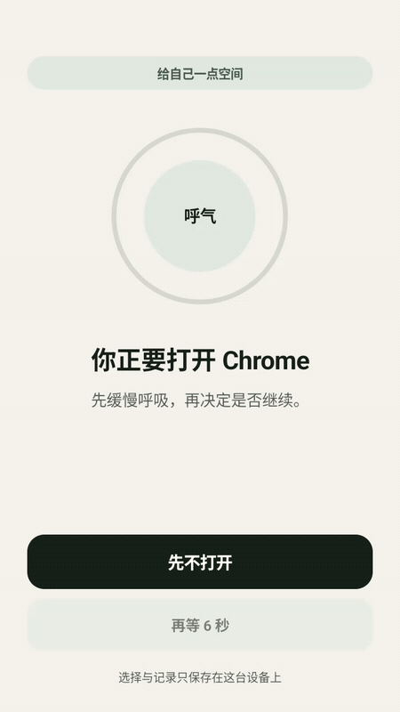
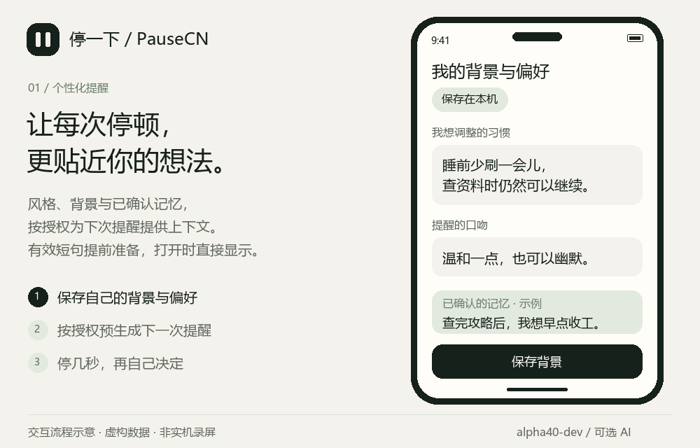
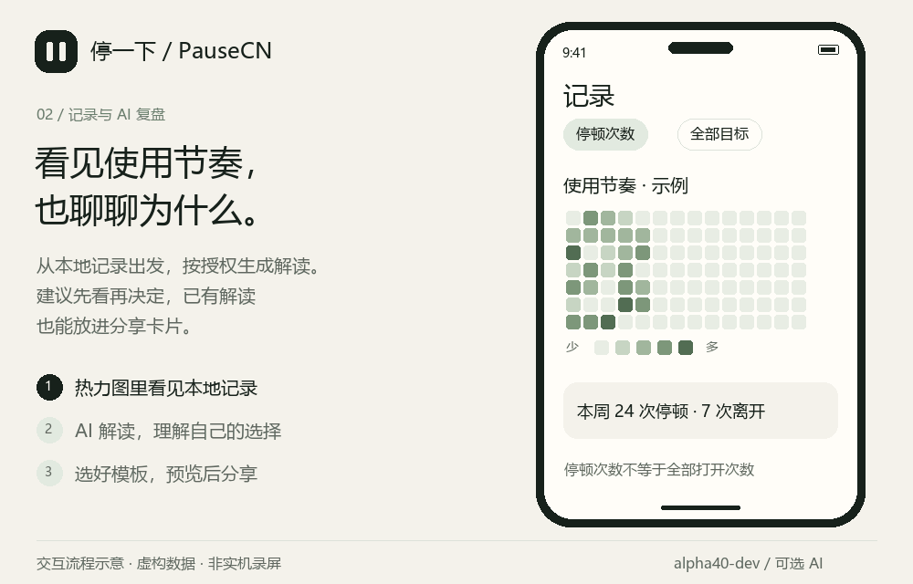

# 停一下 · PauseCN

面向中文使用场景的 Android 停顿提醒工具：打开选定应用时，先停几秒，再选择离开或带着目的继续。继续使用不代表失败。

**不只停几秒，也让提醒有你的背景。** 可选接入 DeepSeek，结合你授权的偏好与记忆，提前准备下次提醒，再通过 AI 解读回看自己的使用节奏。

当前版本：`0.2.0-alpha40-dev`（versionCode 41）。这是自用开发版，适合少量自愿试用，不是正式上架版本。项目受打开前停顿的交互思路启发，与 one sec 无官方关联。

[下载 Android 开发预览版](https://github.com/markgfu/PauseCN/releases/tag/v0.2.0-alpha40-dev) · [使用说明](guide/USAGE.md) · [提交反馈](https://github.com/markgfu/PauseCN/issues)

Android 10+。Releases 中提供的是 **Debug APK / Pre-release**，不是正式发行构建。遇到系统风险拦截请停止，不关闭防护来安装；其他已知限制见下文。AI 默认关闭，需要自己的 API Key，调用可能收费。

## 在停顿之上，加一层 AI 陪伴

打开前停顿是起点，本项目重点扩展的是：

- **提醒有背景**：自己定语气、目标和偏好，按授权结合画像、相关已确认记忆、反馈，以及相应场景可用的近期记录。过去的继续理由不是下次打开的目的。
- **下次先准备好**：在授权范围内提前生成应用专属提醒；有效新句可以直接用于下次停顿，不让网络请求卡住打开流程。
- **记忆由你管理**：交流不局限在日周报里，记忆支持查看、确认、纠正和忘记。保存本地数据与允许发送给 AI 分开控制。
- **记录能解读，也能分享**：本地热力图、日周报可结合 AI 解读；分享卡片可以加入已有解读。AI 也能给出分类和设置建议，修改前仍需你确认。

这里介绍的是 PauseCN 自身的功能重点，不是与 one sec 当前版本的完整功能对比。不开 AI，基础停顿与本地记录仍可使用。

## 实际运行：Android 模拟器录屏

下面新增的是 **alpha40 APK 在 Android 16 模拟器中的实际画面**，不是重绘界面。约 10 秒，展示打开 Chrome 后的停顿、呼吸提示和倒计时结束状态。原来的两段 AI 流程示意仍保留在下一节。

<p align="center">
  
</p>

[观看或下载 MP4](https://github.com/markgfu/PauseCN/releases/download/v0.2.0-alpha40-dev/pausecn-emulator-alpha40.mp4) · [静态画面](guide/media/emulator-pause.png) · [录制范围与限制](guide/EMULATOR_RECORDING.md)

这是独立模拟器中的局部录屏，未使用实体手机数据，未填写 Key 或调用 AI。受录制环境影响帧率较低；完整导航尝试中出现过系统及应用未响应，原因尚未定位，因此没有把它当作完整流程或稳定性验收。没有加速倒计时、插帧或替换屏幕内容。

## 效果演示

以下动图为依据现有功能制作的**简化流程示意**，不是实机录屏；界面、数字、背景、记忆和 AI 文字均为演示内容，不含真实用户记录。实际布局以 APK 为准，示例不保证每次生成效果。

### 个性化背景 → 预生成 → 下一次停顿



[查看静态示意](guide/media/ai-reminder.png)。预生成需单独开启；普通句库仍需要确认应用。实际继续或离开后可能触发下一次准备，并产生 API 费用。

### 热力图 → AI 解读 → 分享卡片



[查看静态示意](guide/media/ai-report.png)。生成解读可能收费；切换分享模板和加入已有解读不调用 AI。分享前请检查内容，隐藏应用名不会自动清除解读中的私人信息。

## 功能

- 目标应用选择、全选/取消全选、搜索，以及统一的自定义分类。
- 打开前提醒、等待倒计时、临时通行和生效时段。
- 继续理由支持选项与输入，按每个应用的使用次数排序，同次数按最近使用排序。
- 本地停顿记录、目标应用前台时长估算、热力图、日周报及图片分享。
- 可选 DeepSeek API：风格短句、个人背景与记忆、下次提醒预生成、交流建议、报告解读和分类建议。
- AI 设置建议需要确认后应用；自动昨日复盘默认关闭。

不配置 AI 也能使用基础停顿、理由、本地记录和手动分类。使用方法见 [使用说明](guide/USAGE.md)。

## 构建

环境：JDK 17 或兼容版本、Android SDK 36、Android SDK Platform-Tools。最低 Android 10（API 29），当前 targetSdk 为 36。

用 Android Studio 打开仓库并配置 Android SDK；本机 SDK 路径可通过不提交的 `local.properties` 指定。首次构建需要联网下载依赖。

Windows PowerShell：

```powershell
.\gradlew.bat :app:assembleDebug
```

macOS / Linux：

```sh
sh ./gradlew :app:assembleDebug
```

输出：`app/build/outputs/apk/debug/app-debug.apk`。Debug 包可以调试，仅连接自己信任的电脑。不同电脑生成的 Debug 签名可能不同，覆盖安装失败时不要直接卸载，以免丢失本地数据。

需要本地单元检查时可运行 `:app:testDebugUnitTest`。`scripts/` 中部分脚本会安装应用、修改测试设置或操作手机，仅限明确了解影响后的专用测试环境，不要在日常手机上直接批量运行。

Release 签名和公开发行元数据通过构建文件中的 `PAUSECN_*` 环境变量配置；仓库不提供签名私钥，也不表示已经满足正式发行条件。

## 代码结构

- `app/src/main/`：Kotlin / Compose 应用、无障碍服务、本地数据、AI 与报告功能。
- `app/src/main/assets/`：提醒与解读提示词等资源。
- `app/src/test/`、`app/src/androidTest/`：本地与设备检查。
- `app/src/debug/`：开发版诊断入口，不属于 Release 源集。
- `app/schemas/`：Room 数据库历史结构。
- `docs/`：构建所需的依赖、许可证与历史安全扫描清单。

依赖扫描文件是历史快照，不是持续的安全保证；其中 SBOM 的应用元数据仍标为 `0.1.0`，不应据此判断当前 APK 版本。以 `app/build.gradle.kts` 为版本来源。

## 隐私与费用

记录默认保存在本机。AI 为可选功能，需要用户填写自己的 API Key；仓库不含共享 Key。Key 在本地通过 Android Keystore 相关机制加密保存。

本地采集与发送 AI 是分开的选项。画像、记忆、理由、分类、时长等按功能授权发送；主动输入的交流内容也可能发送给服务商。不要提交 Key、备份、完整系统日志或未遮挡的私人报告到 GitHub。

API 请求可能收费，包括部分失败、取消或超时情况。本应用没有每日生成总数或费用硬上限；启用个性化预生成后，真实选择可能自动为下次准备短句。请自行关注 API 账户用量。

## 已知限制

- 当前主要在单台 Android 16 真机验证，未覆盖各品牌 ROM；最低版本支持不等于所有设备已实测。
- 部分系统可能拦截安装或撤销无障碍权限，原因尚未解决。不要把关闭系统防护当成修复。
- 前台时长是授权后对目标应用的估算，不是全机屏幕时间；缺失不等于零。
- 自动复盘有一次自然调度成功记录，不保证每天准时运行。
- AI 设置建议的真实设备应用/撤销闭环尚未完成验证。AI 解读可能误述或误解记录，不是心理诊断。

源码仓库包含构建资源、通用说明与虚构演示素材；当前开发 APK 单独放在 GitHub Releases。私人实测记录、本机配置、密钥和本地历史安装包不上传。暂未选择项目开源许可证。
